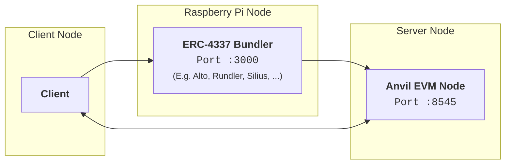

# ERC-4337-Bundlers-Test-Setup

---

Base repository : <https://github.com/eonica/FastTrack-ERC-4337-Experimental-Bundler-Deployment>

This repository adds explanations on the Raspberry Pi power consumption measurement setup.
For this experimental setup we used [PowerJoular](https://github.com/joular/powerjoular) and [PowerSpy](https://github.com/patrickmarlier/powerspy.py).

## Setup Guidelines

First, install docker were needed (EVM node and Raspberry Pi. You'll find under `scripts/utils/docker-install.sh` the script for a clean installation.

Second, setup the client install package.json project dependencies.

Then setup your node (EVM alone or with bundler) particularly you will need to install PowerAPI dependencies.

More details on the native execution [dependencies](./docs/Dependencies-native-setup) in the docs.

### Client

In your client machine. Go into the `client` folder and run:

 ```bash
 npm install
 npm install typescript 
 npm install --save-dev @types/node
 ```

### EVM node

First run the `scripts/power/powerAPI/smartwatts-setup.sh` script to pull the `hwpc-sensor` image and install smartwatts requirements.

Build your EVM client. In this setup we use Anvil. Go into `powerexp/anvil/` and run `docker build --no-cache --progress=plain -t anvil-debian-slim:local -f AnvilDockerfile .`

---

### Raspberry Pi setup

Check the [docs](./docs/Raspberry-pi-setup.md#raspberry-pi-setup) on raspberry pi for the guidelines and requirements.

---

### Architecture diagram



Your final setup should look like this.

---

## Testing

Once everything is setup.

In `client/raspi_tests` on your client machine, you will find all the tests scripts needed to reproduce the experiment.

You can run single tests with:

```bash
./runRaspiTest.sh [NODE_MACHINE] [BUNDLER_MACHINE] [OUTPUT_FILE] [ROUNDS_TOTAL] [SCA_NUMBER] [THROTTLE_TIME] [BLOCK_TIME] [MAC_ADDRESS: with powerspy] [BUNDLER] [POWER_TOOL]
# examples
./runRaspiTest.sh 172.28.30.238 172.28.11.252 test 20 10 10 12 00:08:99:4D:F8:F0 rundler powerspy
./runRaspiTest.sh machine.maas 172.28.11.252 test 20 10 10 12 alto powerjoular # mac address not needed for powerjoular

```

Or run a batch of tests:

```bash
./runAllRaspiTests.sh [MACHINE] [BUNDLER_MACHINE] [MAC_ADDRESS: only with powerspy] [BUNDLER] [POWER_TOOL]
# examples
./runAllRaspiTests.sh 172.28.30.222 172.38.11.232 test 00:08:99:4D:F8:F0 rundler powerspy
./runAllRaspiTests.sh machine.ca 172.38.11.232 test alto powerjoular # mac address not needed for powerjoular

```
